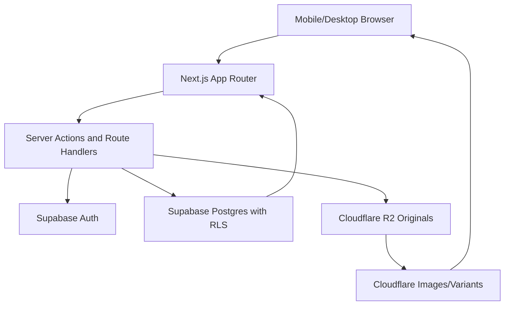
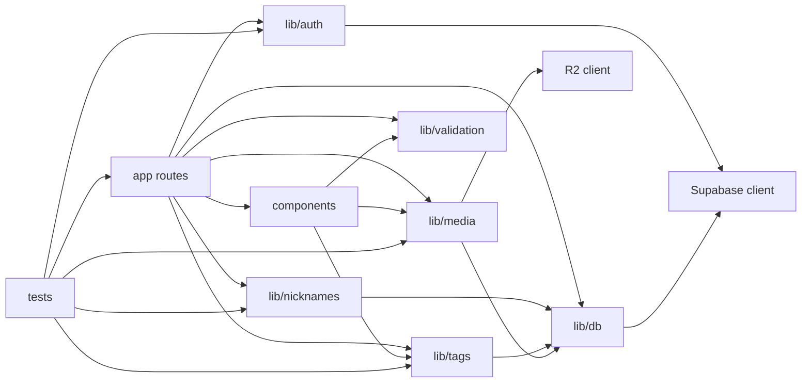

# Code Architecture Graph

## Runtime Architecture



## Code Module Graph



## First Implementation Slice

```mermaid
flowchart TD
    EventForm[components/event-form.tsx]
    CreateEventRoute[app/api/events/route.ts]
    EventValidation[lib/validation/event.ts]
    EventQueries[lib/db/queries/events.ts]
    ShareQueries[lib/db/queries/share-access.ts]
    QRPanel[components/qr-share-panel.tsx]
    EventPage[app/(organizer)/events/[eventId]/page.tsx]

    EventForm --> CreateEventRoute
    CreateEventRoute --> EventValidation
    CreateEventRoute --> EventQueries
    CreateEventRoute --> ShareQueries
    EventQueries --> EventPage
    ShareQueries --> QRPanel
    EventPage --> QRPanel
```
