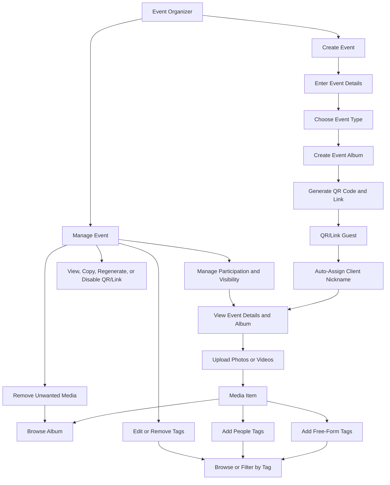
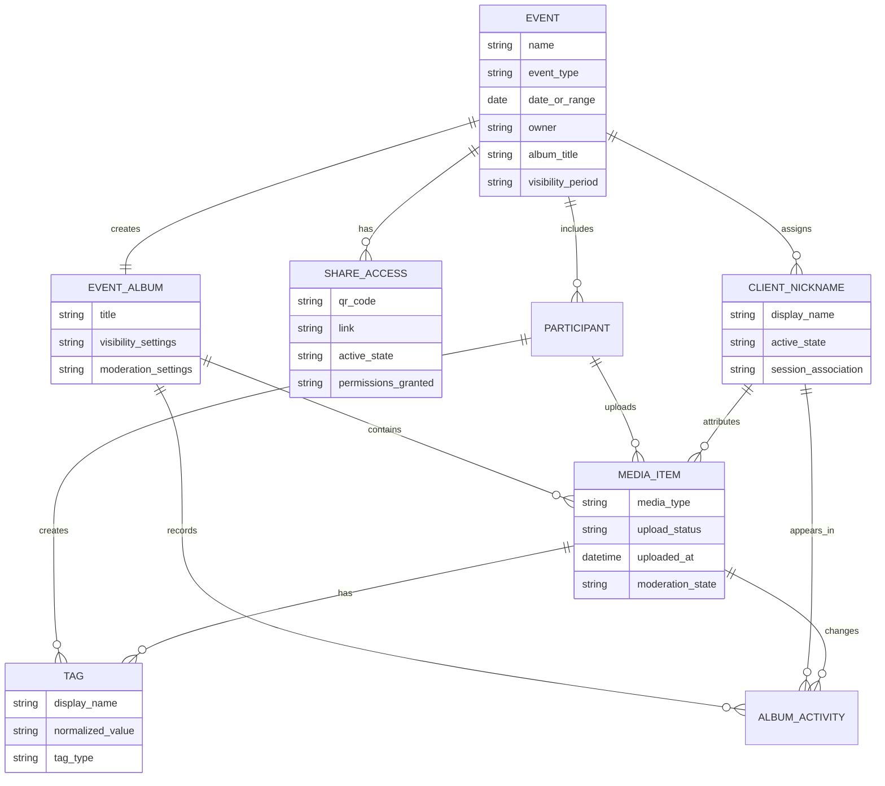
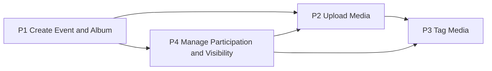

# Event Album Media Sharing Graph

## Product Flow

```mermaid
flowchart TD
    Organizer[Event Organizer]
    Guest[QR/Link Guest]

    Organizer --> CreateEvent[Create Event]
    CreateEvent --> EventDetails[Enter Event Details]
    EventDetails --> EventType[Choose Event Type]
    EventType --> EventAlbum[Create Event Album]
    EventAlbum --> ShareAccess[Generate QR Code and Link]

    ShareAccess --> Guest
    Guest --> AssignNickname[Auto-Assign Client Nickname]
    AssignNickname --> ViewAlbum[View Event Details and Album]
    ViewAlbum --> UploadMedia[Upload Photos or Videos]
    UploadMedia --> MediaItem[Media Item]
    MediaItem --> BrowseAlbum[Browse Album]
    MediaItem --> AddTags[Add Free-Form Tags]
    MediaItem --> AddPeopleTags[Add People Tags]

    AddTags --> TagSearch[Browse or Filter by Tag]
    AddPeopleTags --> TagSearch

    Organizer --> ManageEvent[Manage Event]
    ManageEvent --> ManageQR[View, Copy, Regenerate, or Disable QR/Link]
    ManageEvent --> ModerateMedia[Remove Unwanted Media]
    ManageEvent --> ModerateTags[Edit or Remove Tags]
    ManageEvent --> Permissions[Manage Participation and Visibility]

    Permissions --> ViewAlbum
    ModerateMedia --> BrowseAlbum
    ModerateTags --> TagSearch
```

## Data Relationship Graph

```mermaid
erDiagram
    EVENT ||--|| EVENT_ALBUM : creates
    EVENT ||--o{ SHARE_ACCESS : has
    EVENT ||--o{ PARTICIPANT : includes
    EVENT ||--o{ CLIENT_NICKNAME : assigns
    EVENT_ALBUM ||--o{ MEDIA_ITEM : contains
    EVENT_ALBUM ||--o{ ALBUM_ACTIVITY : records
    PARTICIPANT ||--o{ MEDIA_ITEM : uploads
    PARTICIPANT ||--o{ TAG : creates
    CLIENT_NICKNAME ||--o{ MEDIA_ITEM : attributes
    CLIENT_NICKNAME ||--o{ ALBUM_ACTIVITY : appears_in
    MEDIA_ITEM ||--o{ TAG : has
    MEDIA_ITEM ||--o{ ALBUM_ACTIVITY : changes

    EVENT {
        string name
        string event_type
        date date_or_range
        string owner
        string album_title
        string visibility_period
    }

    EVENT_ALBUM {
        string title
        string visibility_settings
        string moderation_settings
    }

    SHARE_ACCESS {
        string qr_code
        string link
        string active_state
        string permissions_granted
    }

    CLIENT_NICKNAME {
        string display_name
        string active_state
        string session_association
    }

    MEDIA_ITEM {
        string media_type
        string upload_status
        datetime uploaded_at
        string moderation_state
    }

    TAG {
        string display_name
        string normalized_value
        string tag_type
    }
```

## Priority Graph

```mermaid
flowchart LR
    P1[P1 Create Event and Album]
    P2[P2 Upload Media]
    P3[P3 Tag Media]
    P4[P4 Manage Participation and Visibility]

    P1 --> P2
    P2 --> P3
    P1 --> P4
    P4 --> P2
    P4 --> P3
```
